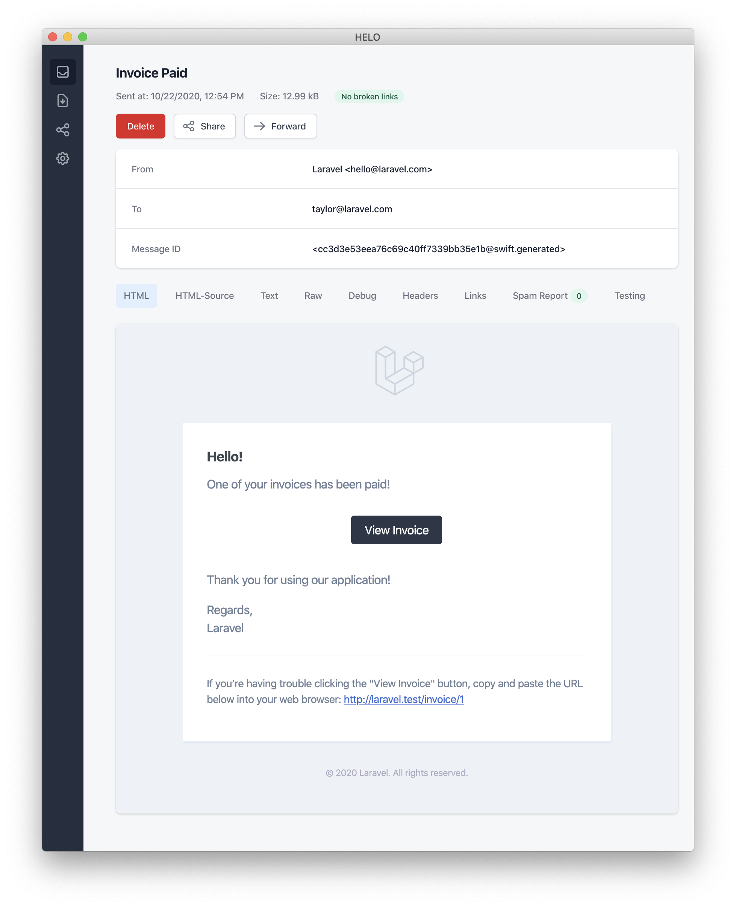

# Уведомления

## Вступление

В дополнение к поддержке [отправки электронной почты](mail.md), Laravel обеспечивает поддержку отправки уведомлений по различным каналам доставки, включая электронную почту, SMS \(через [Vonage](https://www.vonage.com/communications-apis/), ранее известный как Nexmo\), и [Slack](https://slack.com/). Кроме того, [сообществом были созданы различные каналы уведомлений](https://laravel-notification-channels.com/about/#suggesting-a-new-channel) для отправки уведомлений по десяткам различных каналов! Уведомления также могут храниться в базе данных, поэтому они могут отображаться в вашем веб-интерфейсе.

Как правило, уведомления должны быть краткими, информационными сообщениями, которые оповещают пользователей о событиях, произошедших в вашем приложении. Например, если вы пишете приложение для выставления счетов, то можете отправить своим пользователям уведомление "Invoice Paid" по электронной почте и SMS-каналам.

## Генерация уведомлений

В Laravel каждое уведомление представлено отдельным классом, который обычно хранится в каталоге `app/Notifications`. Не волнуйтесь, если вы не увидите этот каталог в вашем приложении — он будет создан, когда вы запустите команду `make:notification`:

```bash
php artisan make:notification InvoicePaid
```

Эта команда поместит новый класс уведомлений в директорию `app/Notifications`. Каждый класс уведомлений содержит метод `via` и различное количество методов построения сообщений, таких как `toMail` или `toDatabase`, которые преобразуют уведомление в сообщение, адаптированное для данного канала.

## Отправка уведомлений

### С использованием трейта Notifiable

Уведомления могут быть отправлены двумя способами: используя метод `notify` из трейта `Notifiable` или с помощью [фасада](facades.md) `Notification`. Трейт `Notifiable` по умолчанию включен в модель `App\Models\User`:

```php
<?php

namespace App\Models;

use Illuminate\Foundation\Auth\User as Authenticatable;
use Illuminate\Notifications\Notifiable;

class User extends Authenticatable
{
    use Notifiable;
}
```

Метод `notify`, предусмотренный этим трейтом, ожидает получения экземпляра уведомления:

```php
use App\Notifications\InvoicePaid;

$user->notify(new InvoicePaid($invoice));
```


Помните, что в любой из моделей вы можете использовать трейт `Notifiable`. Вы не ограничены включением его только в модель `User`.


### С использованием фасада Notification

Кроме того, вы можете отправлять уведомления через [фасад ](facades.md)Notification. Такой подход полезен, когда вам нужно отправить уведомление нескольким уведомляемым субъектам, например, коллекции пользователей. Чтобы отправить уведомления через фасад, передайте все уведомляемые объекты и экземпляр уведомления в метод `send` \(отправить\):

```php
use Illuminate\Support\Facades\Notification;

Notification::send($users, new InvoicePaid($invoice));
```

### Определение каналов доставки

Каждый класс уведомлений имеет метод `via`, который определяет, по каким каналам будет доставляться уведомление. Уведомления могут быть отправлены по каналам `mail`, `database`, `broadcast`, `nexmo` и `slack`.


Если Вы хотите использовать другие каналы доставки, например, Telegram или Pusher, посетите веб-сайт сообщества [Laravel Notification Channels](http://laravel-notification-channels.com/).


Метод `via` получает экземпляр `$notifiable`, который является экземпляром класса, в который отправляется оповещение. Вы можете использовать `$notifiable`, чтобы определить, по каким каналам должно быть доставлено уведомление:

```php
/**
 * Получить каналы доставки уведомления.
 *
 * @param  mixed  $notifiable
 * @return array
 */
public function via($notifiable)
{
    return $notifiable->prefers_sms ? ['nexmo'] : ['mail', 'database'];
}
```

### Очередь уведомлений


Перед тем как отправить уведомление в очередь, вы должны настроить вашу очередь и [запустить воркер](queues.md).


Отправка уведомлений может занять некоторое время, особенно если каналу необходимо сделать внешний вызов API, чтобы доставить оповещение. Чтобы ускорить время отклика вашего приложения, добавьте к вашему классу интерфейс `ShouldQueue` и трейт `Queueable`, чтобы поставить уведомление в очередь. Интерфейс и трейт уже импортированы для всех уведомлений, генерируемых с помощью команды `make:notification`, поэтому вы можете сразу же добавить их в свой класс уведомлений:

```php
<?php

namespace App\Notifications;

use Illuminate\Bus\Queueable;
use Illuminate\Contracts\Queue\ShouldQueue;
use Illuminate\Notifications\Notification;

class InvoicePaid extends Notification implements ShouldQueue
{
    use Queueable;

    // ...
}
```

Если интерфейс `ShouldQueue` был добавлен к вашему уведомлению, вы можете отправить оповещение обычным способом. Laravel обнаружит интерфейс `ShouldQueue` в классе и автоматически поставит в очередь доставку уведомления:

```php
$user->notify(new InvoicePaid($invoice));
```

Если вы хотите задержать доставку уведомления, то можете включить метод `delay`:

```php
$delay = now()->addMinutes(10);

$user->notify((new InvoicePaid($invoice))->delay($delay));
```

Можно передать массив в метод `delay`, чтобы указать величину задержки для конкретных каналов:

```php
$user->notify((new InvoicePaid($invoice))->delay([
    'mail' => now()->addMinutes(5),
    'sms' => now()->addMinutes(10),
]));
```

При отправке уведомлений в очередь для каждого получателя и комбинации каналов будет создано задание в очереди. Например, шесть заданий будут поставлены в очередь, если в вашем уведомлении три получателя и два канала.

#### Настройка соединения очереди уведомлений

По умолчанию, уведомления, поставленные в очередь, будут отправляться по стандартному подключению вашего приложения к очереди. Если вы хотите указать другое соединение, которое должно использоваться для конкретного уведомления, то можете определить свойство `$connection` в классе уведомлений:

```php
/**
 * Имя подключения для использования при постановке уведомления в очередь.
 *
 * @var string
 */
public $connection = 'redis';
```

#### Настройка очередей каналов уведомления

Если вы хотите указать конкретную очередь, которая должна использоваться для каждого канала оповещения, поддерживаемого оповещением, вы можете определить метод `viaQueues` в вашем оповещении. Этот метод должен возвращать массив пар имя канала / имя очереди:

```php
/**
 * Определите, какие очереди следует использовать для каждого канала оповещения.
 *
 * @return array
 */
public function viaQueues()
{
    return [
        'mail' => 'mail-queue',
        'slack' => 'slack-queue',
    ];
}
```

#### **Queued Notifications & Database Transactions**

Когда уведомление в очереди отправляется внутри транзакций БД, оно может быть обработано очередью до того, как транзакция БД будет зафиксирована. В этом случае любые обновления моделей или записей в БД, сделанные вами во время транзакции с БД, могут еще не отразиться в БД. Кроме того, любые модели или записи БД, созданные внутри транзакции, могут не существовать в БД. Если уведомление зависит от этих моделей, то при обработке задания, отправляющего уведомление в очередь, могут возникать неожиданные ошибки.

Если параметр конфигурации соединения в очереди `after_commit` установлен в `false`, вы можете указать, что после фиксации всех открытых транзакций в БД должно быть отправлено определенное уведомление в очереди, определив свойство `$afterCommit` в классе уведомлений:

```php
<?php

namespace App\Notifications;

use Illuminate\Bus\Queueable;
use Illuminate\Contracts\Queue\ShouldQueue;
use Illuminate\Notifications\Notification;

class InvoicePaid extends Notification implements ShouldQueue
{
    use Queueable;

    public $afterCommit = true;
}
```


Чтобы узнать больше о работе с этими проблемами, ознакомьтесь, пожалуйста, с документацией, касающейся [очередей на задания и операций с базами данных](queues.md).


### Уведомления по требованию

В некоторых случаях вам может понадобиться отправить уведомление тому, кто не является "пользователем" вашего приложения. Используя метод `route` фасада `Notification`, вы можете указать специальную информацию о маршрутизации уведомлений перед отправкой уведомления:

```php
Notification::route('mail', 'taylor@example.com')
            ->route('nexmo', '5555555555')
            ->route('slack', 'https://hooks.slack.com/services/...')
            ->notify(new InvoicePaid($invoice));
```

## Почтовые уведомления

### Форматирование почтовых сообщений

Если уведомление поддерживает отправку по электронной почте, необходимо определить метод `toMail` в классе уведомлений. Этот метод будет получать сущность `$notifiable` и должен возвращать экземпляр `Illuminate\Notifications\Messages\MailMessage`.

Класс `MailMessage` содержит несколько простых методов, которые помогут вам строить транзакционные сообщения электронной почты. Письма могут содержать как строки текста, так и "призыв к действию" \(CTA\). Рассмотрим пример метода `toMail`:

```php
/**
 * Get the mail representation of the notification.
 *
 * @param  mixed  $notifiable
 * @return \Illuminate\Notifications\Messages\MailMessage
 */
public function toMail($notifiable)
{
    $url = url('/invoice/'.$this->invoice->id);

    return (new MailMessage)
                ->greeting('Hello!')
                ->line('One of your invoices has been paid!')
                ->action('View Invoice', $url)
                ->line('Thank you for using our application!');
}
```


Обратите внимание, что в нашем методе `toMail` мы используем `$this->invoicee->id`. Вы можете передать любые данные, необходимые вашему уведомлению для генерации его сообщения, в конструктор уведомления.


В этом примере мы регистрируем приветствие, строку текста, призыв к действию, а затем еще одну строку текста. Эти методы, предоставляемые объектом `MailMessage`, упрощают и ускоряют форматирование небольших транзакционных сообщений. Затем почтовый канал переводит компоненты сообщения в красивый, отзывчивый шаблон HTML-почты с простым текстовым контрагентом. Вот пример письма, сгенерированного `mail` каналом:




При отправке почтовых уведомлений обязательно установите параметр `name` в конфигурационном файле `config/app.php`. Это значение будет использоваться в заголовке и нижнем колонтитуле ваших почтовых уведомлений.


#### **Other Mail Notification Formatting Options**

Instead of defining the "lines" of text in the notification class, you may use the `view` method to specify a custom template that should be used to render the notification email:

```php
/**
 * Get the mail representation of the notification.
 *
 * @param  mixed  $notifiable
 * @return \Illuminate\Notifications\Messages\MailMessage
 */
public function toMail($notifiable)
{
    return (new MailMessage)->view(
        'emails.name', ['invoice' => $this->invoice]
    );
}
```

You may specify a plain-text view for the mail message by passing the view name as the second element of an array that is given to the `view` method:

```php
/**
 * Get the mail representation of the notification.
 *
 * @param  mixed  $notifiable
 * @return \Illuminate\Notifications\Messages\MailMessage
 */
public function toMail($notifiable)
{
    return (new MailMessage)->view(
        ['emails.name.html', 'emails.name.plain'],
        ['invoice' => $this->invoice]
    );
}
```

In addition, you may return a full [mailable object](https://laravel.com/docs/8.x/mail) from the `toMail` method:

```php
use App\Mail\InvoicePaid as InvoicePaidMailable;

/**
 * Get the mail representation of the notification.
 *
 * @param  mixed  $notifiable
 * @return Mailable
 */
public function toMail($notifiable)
{
    return (new InvoicePaidMailable($this->invoice))
                ->to($notifiable->email);
}
```

#### **Error Messages**

Some notifications inform users of errors, such as a failed invoice payment. You may indicate that a mail message is regarding an error by calling the `error` method when building your message. When using the `error` method on a mail message, the call to action button will be red instead of black:

```php
/**
 * Get the mail representation of the notification.
 *
 * @param  mixed  $notifiable
 * @return \Illuminate\Notifications\Message
 */
public function toMail($notifiable)
{
    return (new MailMessage)
                ->error()
                ->subject('Notification Subject')
                ->line('...');
}
```

### Customizing The Sender

By default, the email's sender / from address is defined in the `config/mail.php` configuration file. However, you may specify the from address for a specific notification using the `from` method:

```php
/**
 * Get the mail representation of the notification.
 *
 * @param  mixed  $notifiable
 * @return \Illuminate\Notifications\Messages\MailMessage
 */
public function toMail($notifiable)
{
    return (new MailMessage)
                ->from('barrett@example.com', 'Barrett Blair')
                ->line('...');
}
```

### Customizing The Recipient

When sending notifications via the `mail` channel, the notification system will automatically look for an `email` property on your notifiable entity. You may customize which email address is used to deliver the notification by defining a `routeNotificationForMail` method on the notifiable entity:

```php
<?php

namespace App\Models;

use Illuminate\Foundation\Auth\User as Authenticatable;
use Illuminate\Notifications\Notifiable;

class User extends Authenticatable
{
    use Notifiable;

    /**
     * Route notifications for the mail channel.
     *
     * @param  \Illuminate\Notifications\Notification  $notification
     * @return array|string
     */
    public function routeNotificationForMail($notification)
    {
        // Return email address only...
        return $this->email_address;

        // Return email address and name...
        return [$this->email_address => $this->name];
    }
}
```

### Customizing The Subject

By default, the email's subject is the class name of the notification formatted to "Title Case". So, if your notification class is named `InvoicePaid`, the email's subject will be `Invoice Paid`. If you would like to specify an different subject for the message, you may call the `subject` method when building your message:

```php
/**
 * Get the mail representation of the notification.
 *
 * @param  mixed  $notifiable
 * @return \Illuminate\Notifications\Messages\MailMessage
 */
public function toMail($notifiable)
{
    return (new MailMessage)
                ->subject('Notification Subject')
                ->line('...');
}
```

### Customizing The Mailer

By default, the email notification will be sent using the default mailer defined in the `config/mail.php` configuration file. However, you may specify a different mailer at runtime by calling the `mailer` method when building your message:

```php
/**
 * Get the mail representation of the notification.
 *
 * @param  mixed  $notifiable
 * @return \Illuminate\Notifications\Messages\MailMessage
 */
public function toMail($notifiable)
{
    return (new MailMessage)
                ->mailer('postmark')
                ->line('...');
}
```

### Customizing The Templates

You can modify the HTML and plain-text template used by mail notifications by publishing the notification package's resources. After running this command, the mail notification templates will be located in the `resources/views/vendor/notifications` directory:

```bash
php artisan vendor:publish --tag=laravel-notifications
```

### Attachments

To add attachments to an email notification, use the `attach` method while building your message. The `attach` method accepts the absolute path to the file as its first argument:

```php
/**
 * Get the mail representation of the notification.
 *
 * @param  mixed  $notifiable
 * @return \Illuminate\Notifications\Messages\MailMessage
 */
public function toMail($notifiable)
{
    return (new MailMessage)
                ->greeting('Hello!')
                ->attach('/path/to/file');
}
```

When attaching files to a message, you may also specify the display name and / or MIME type by passing an `array` as the second argument to the `attach` method:

```php
/**
 * Get the mail representation of the notification.
 *
 * @param  mixed  $notifiable
 * @return \Illuminate\Notifications\Messages\MailMessage
 */
public function toMail($notifiable)
{
    return (new MailMessage)
                ->greeting('Hello!')
                ->attach('/path/to/file', [
                    'as' => 'name.pdf',
                    'mime' => 'application/pdf',
                ]);
}
```

Unlike attaching files in mailable objects, you may not attach a file directly from a storage disk using `attachFromStorage`. You should rather use the `attach` method with an absolute path to the file on the storage disk. Alternatively, you could return a [mailable](https://laravel.com/docs/8.x/mail#generating-mailables) from the `toMail` method:

```php
use App\Mail\InvoicePaid as InvoicePaidMailable;

/**
 * Get the mail representation of the notification.
 *
 * @param  mixed  $notifiable
 * @return Mailable
 */
public function toMail($notifiable)
{
    return (new InvoicePaidMailable($this->invoice))
                ->to($notifiable->email)
                ->attachFromStorage('/path/to/file');
}
```

#### **Raw Data Attachments**

The `attachData` method may be used to attach a raw string of bytes as an attachment. When calling the `attachData` method, you should provide the filename that should be assigned to the attachment:

```php
/**
 * Get the mail representation of the notification.
 *
 * @param  mixed  $notifiable
 * @return \Illuminate\Notifications\Messages\MailMessage
 */
public function toMail($notifiable)
{
    return (new MailMessage)
                ->greeting('Hello!')
                ->attachData($this->pdf, 'name.pdf', [
                    'mime' => 'application/pdf',
                ]);
}
```

### Previewing Mail Notifications

When designing a mail notification template, it is convenient to quickly preview the rendered mail message in your browser like a typical Blade template. For this reason, Laravel allows you to return any mail message generated by a mail notification directly from a route closure or controller. When a `MailMessage` is returned, it will be rendered and displayed in the browser, allowing you to quickly preview its design without needing to send it to an actual email address:

```php
use App\Models\Invoice;
use App\Notifications\InvoicePaid;

Route::get('/notification', function () {
    $invoice = Invoice::find(1);

    return (new InvoicePaid($invoice))
                ->toMail($invoice->user);
});
```

## Markdown Mail Notifications

Markdown mail notifications allow you to take advantage of the pre-built templates of mail notifications, while giving you more freedom to write longer, customized messages. Since the messages are written in Markdown, Laravel is able to render beautiful, responsive HTML templates for the messages while also automatically generating a plain-text counterpart.

### Generating The Message

To generate a notification with a corresponding Markdown template, you may use the `--markdown` option of the `make:notification` Artisan command:

```bash
php artisan make:notification InvoicePaid --markdown=mail.invoice.paid
```

Like all other mail notifications, notifications that use Markdown templates should define a `toMail` method on their notification class. However, instead of using the `line` and `action` methods to construct the notification, use the `markdown` method to specify the name of the Markdown template that should be used. An array of data you wish to make available to the template may be passed as the method's second argument:

```php
/**
 * Get the mail representation of the notification.
 *
 * @param  mixed  $notifiable
 * @return \Illuminate\Notifications\Messages\MailMessage
 */
public function toMail($notifiable)
{
    $url = url('/invoice/'.$this->invoice->id);

    return (new MailMessage)
                ->subject('Invoice Paid')
                ->markdown('mail.invoice.paid', ['url' => $url]);
}
```

### Writing The Message

Markdown mail notifications use a combination of Blade components and Markdown syntax which allow you to easily construct notifications while leveraging Laravel's pre-crafted notification components:

```markup
@component('mail::message')
# Invoice Paid

Your invoice has been paid!

@component('mail::button', ['url' => $url])
View Invoice
@endcomponent

Thanks,<br>
{{ config('app.name') }}
@endcomponent
```

#### **Button Component**

The button component renders a centered button link. The component accepts two arguments, a `url` and an optional `color`. Supported colors are `primary`, `green`, and `red`. You may add as many button components to a notification as you wish:

```markup
@component('mail::button', ['url' => $url, 'color' => 'green'])
View Invoice
@endcomponent
```

#### **Panel Component**

The panel component renders the given block of text in a panel that has a slightly different background color than the rest of the notification. This allows you to draw attention to a given block of text:

```markup
@component('mail::panel')
This is the panel content.
@endcomponent
```

#### **Table Component**

The table component allows you to transform a Markdown table into an HTML table. The component accepts the Markdown table as its content. Table column alignment is supported using the default Markdown table alignment syntax:

```markup
@component('mail::table')
| Laravel       | Table         | Example  |
| ------------- |:-------------:| --------:|
| Col 2 is      | Centered      | $10      |
| Col 3 is      | Right-Aligned | $20      |
@endcomponent
```

### Customizing The Components

You may export all of the Markdown notification components to your own application for customization. To export the components, use the `vendor:publish` Artisan command to publish the `laravel-mail` asset tag:

```bash
php artisan vendor:publish --tag=laravel-mail
```

This command will publish the Markdown mail components to the `resources/views/vendor/mail` directory. The `mail` directory will contain an `html` and a `text` directory, each containing their respective representations of every available component. You are free to customize these components however you like.

#### **Customizing The CSS**

After exporting the components, the `resources/views/vendor/mail/html/themes` directory will contain a `default.css` file. You may customize the CSS in this file and your styles will automatically be in-lined within the HTML representations of your Markdown notifications.

If you would like to build an entirely new theme for Laravel's Markdown components, you may place a CSS file within the `html/themes` directory. After naming and saving your CSS file, update the `theme` option of the `mail` configuration file to match the name of your new theme.

To customize the theme for an individual notification, you may call the `theme` method while building the notification's mail message. The `theme` method accepts the name of the theme that should be used when sending the notification:

```php
/**
 * Get the mail representation of the notification.
 *
 * @param  mixed  $notifiable
 * @return \Illuminate\Notifications\Messages\MailMessage
 */
public function toMail($notifiable)
{
    return (new MailMessage)
                ->theme('invoice')
                ->subject('Invoice Paid')
                ->markdown('mail.invoice.paid', ['url' => $url]);
}
```

## Database Notifications

### Prerequisites

The `database` notification channel stores the notification information in a database table. This table will contain information such as the notification type as well as a JSON data structure that describes the notification.

You can query the table to display the notifications in your application's user interface. But, before you can do that, you will need to create a database table to hold your notifications. You may use the `notifications:table` command to generate a [migration](https://laravel.com/docs/8.x/migrations) with the proper table schema:

```bash
php artisan notifications:table

php artisan migrate
```

### Formatting Database Notifications

If a notification supports being stored in a database table, you should define a `toDatabase` or `toArray` method on the notification class. This method will receive a `$notifiable` entity and should return a plain PHP array. The returned array will be encoded as JSON and stored in the `data` column of your `notifications` table. Let's take a look at an example `toArray` method:

```php
/**
 * Get the array representation of the notification.
 *
 * @param  mixed  $notifiable
 * @return array
 */
public function toArray($notifiable)
{
    return [
        'invoice_id' => $this->invoice->id,
        'amount' => $this->invoice->amount,
    ];
}
```

#### **toDatabase Vs. toArray**

The `toArray` method is also used by the `broadcast` channel to determine which data to broadcast to your JavaScript powered frontend. If you would like to have two different array representations for the `database` and `broadcast` channels, you should define a `toDatabase` method instead of a `toArray` method.

### Accessing The Notifications

Once notifications are stored in the database, you need a convenient way to access them from your notifiable entities. The `Illuminate\Notifications\Notifiable` trait, which is included on Laravel's default `App\Models\User` model, includes a `notifications` [Eloquent relationship](https://laravel.com/docs/8.x/eloquent-relationships) that returns the notifications for the entity. To fetch notifications, you may access this method like any other Eloquent relationship. By default, notifications will be sorted by the `created_at` timestamp with the most recent notifications at the beginning of the collection:

```php
$user = App\Models\User::find(1);

foreach ($user->notifications as $notification) {
    echo $notification->type;
}
```

If you want to retrieve only the "unread" notifications, you may use the `unreadNotifications` relationship. Again, these notifications will be sorted by the `created_at` timestamp with the most recent notifications at the beginning of the collection:

```php
$user = App\Models\User::find(1);

foreach ($user->unreadNotifications as $notification) {
    echo $notification->type;
}
```

> 
>
> To access your notifications from your JavaScript client, you should define a notification controller for your application which returns the notifications for a notifiable entity, such as the current user. You may then make an HTTP request to that controller's URL from your JavaScript client.

### Marking Notifications As Read

Typically, you will want to mark a notification as "read" when a user views it. The `Illuminate\Notifications\Notifiable` trait provides a `markAsRead` method, which updates the `read_at` column on the notification's database record:

```php
$user = App\Models\User::find(1);

foreach ($user->unreadNotifications as $notification) {
    $notification->markAsRead();
}
```

However, instead of looping through each notification, you may use the `markAsRead` method directly on a collection of notifications:

```php
$user->unreadNotifications->markAsRead();
```

You may also use a mass-update query to mark all of the notifications as read without retrieving them from the database:

```php
$user = App\Models\User::find(1);

$user->unreadNotifications()->update(['read_at' => now()]);
```

You may `delete` the notifications to remove them from the table entirely:

```php
$user->notifications()->delete();
```

## Broadcast Notifications

### Prerequisites

Before broadcasting notifications, you should configure and be familiar with Laravel's [event broadcasting](https://laravel.com/docs/8.x/broadcasting) services. Event broadcasting provides a way to react to server-side Laravel events from your JavaScript powered frontend.

### Formatting Broadcast Notifications

The `broadcast` channel broadcasts notifications using Laravel's [event broadcasting](https://laravel.com/docs/8.x/broadcasting) services, allowing your JavaScript powered frontend to catch notifications in realtime. If a notification supports broadcasting, you can define a `toBroadcast` method on the notification class. This method will receive a `$notifiable` entity and should return a `BroadcastMessage` instance. If the `toBroadcast` method does not exist, the `toArray` method will be used to gather the data that should be broadcast. The returned data will be encoded as JSON and broadcast to your JavaScript powered frontend. Let's take a look at an example `toBroadcast` method:

```php
use Illuminate\Notifications\Messages\BroadcastMessage;

/**
 * Get the broadcastable representation of the notification.
 *
 * @param  mixed  $notifiable
 * @return BroadcastMessage
 */
public function toBroadcast($notifiable)
{
    return new BroadcastMessage([
        'invoice_id' => $this->invoice->id,
        'amount' => $this->invoice->amount,
    ]);
}
```

#### **Broadcast Queue Configuration**

All broadcast notifications are queued for broadcasting. If you would like to configure the queue connection or queue name that is used to queue the broadcast operation, you may use the `onConnection` and `onQueue` methods of the `BroadcastMessage`:

```php
return (new BroadcastMessage($data))
                ->onConnection('sqs')
                ->onQueue('broadcasts');
```

#### **Customizing The Notification Type**

In addition to the data you specify, all broadcast notifications also have a `type` field containing the full class name of the notification. If you would like to customize the notification `type`, you may define a `broadcastType` method on the notification class:

```php
use Illuminate\Notifications\Messages\BroadcastMessage;

/**
 * Get the type of the notification being broadcast.
 *
 * @return string
 */
public function broadcastType()
{
    return 'broadcast.message';
}
```

### Listening For Notifications

Notifications will broadcast on a private channel formatted using a `{notifiable}.{id}` convention. So, if you are sending a notification to an `App\Models\User` instance with an ID of `1`, the notification will be broadcast on the `App.Models.User.1` private channel. When using [Laravel Echo](https://laravel.com/docs/8.x/broadcasting), you may easily listen for notifications on a channel using the `notification` method:

```javascript
Echo.private('App.Models.User.' + userId)
    .notification((notification) => {
        console.log(notification.type);
    });
```

#### **Customizing The Notification Channel**

If you would like to customize which channel that an entity's broadcast notifications are broadcast on, you may define a `receivesBroadcastNotificationsOn` method on the notifiable entity:

```php
<?php

namespace App\Models;

use Illuminate\Broadcasting\PrivateChannel;
use Illuminate\Foundation\Auth\User as Authenticatable;
use Illuminate\Notifications\Notifiable;

class User extends Authenticatable
{
    use Notifiable;

    /**
     * The channels the user receives notification broadcasts on.
     *
     * @return string
     */
    public function receivesBroadcastNotificationsOn()
    {
        return 'users.'.$this->id;
    }
}
```

## SMS Notifications

### Prerequisites

Sending SMS notifications in Laravel is powered by [Vonage](https://www.vonage.com/) \(formerly known as Nexmo\). Before you can send notifications via Vonage, you need to install the `laravel/nexmo-notification-channel` and `nexmo/laravel` Composer packages

```bash
composer require laravel/nexmo-notification-channel nexmo/laravel
```

The `nexmo/laravel` package includes [its own configuration file](https://github.com/Nexmo/nexmo-laravel/blob/master/config/nexmo.php). However, you are not required to export this configuration file to your own application. You can simply use the `NEXMO_KEY` and `NEXMO_SECRET` environment variables to set your Vonage public and secret key.

Next, you will need to add a `nexmo` configuration entry to your `config/services.php` configuration file. You may copy the example configuration below to get started:

```php
'nexmo' => [
    'sms_from' => '15556666666',
],
```

The `sms_from` option is the phone number that your SMS messages will be sent from. You should generate a phone number for your application in the Vonage control panel.

### Formatting SMS Notifications

If a notification supports being sent as an SMS, you should define a `toNexmo` method on the notification class. This method will receive a `$notifiable` entity and should return an `Illuminate\Notifications\Messages\NexmoMessage` instance:

```php
/**
 * Get the Vonage / SMS representation of the notification.
 *
 * @param  mixed  $notifiable
 * @return \Illuminate\Notifications\Messages\NexmoMessage
 */
public function toNexmo($notifiable)
{
    return (new NexmoMessage)
                ->content('Your SMS message content');
}
```

#### **Unicode Content**

If your SMS message will contain unicode characters, you should call the `unicode` method when constructing the `NexmoMessage` instance:

```php
/**
 * Get the Vonage / SMS representation of the notification.
 *
 * @param  mixed  $notifiable
 * @return \Illuminate\Notifications\Messages\NexmoMessage
 */
public function toNexmo($notifiable)
{
    return (new NexmoMessage)
                ->content('Your unicode message')
                ->unicode();
}
```

### Formatting Shortcode Notifications

Laravel also supports sending shortcode notifications, which are pre-defined message templates in your Vonage account. To send a shortcode SMS notification, you should define a `toShortcode` method on your notification class. From within this method, you may return an array specifying the type of notification \(`alert`, `2fa`, or `marketing`\) as well as the custom values that will populate the template:

```php
/**
 * Get the Vonage / Shortcode representation of the notification.
 *
 * @param  mixed  $notifiable
 * @return array
 */
public function toShortcode($notifiable)
{
    return [
        'type' => 'alert',
        'custom' => [
            'code' => 'ABC123',
        ];
    ];
}
```

> 
>
> Like [routing SMS Notifications](https://laravel.com/docs/8.x/notifications#routing-sms-notifications), you should implement the `routeNotificationForShortcode` method on your notifiable model.

### Customizing The "From" Number

If you would like to send some notifications from a phone number that is different from the phone number specified in your `config/services.php` file, you may call the `from` method on a `NexmoMessage` instance:

```php
/**
 * Get the Vonage / SMS representation of the notification.
 *
 * @param  mixed  $notifiable
 * @return NexmoMessage
 */
public function toNexmo($notifiable)
{
    return (new NexmoMessage)
                ->content('Your SMS message content')
                ->from('15554443333');
}
```

### Routing SMS Notifications

To route Vonage notifications to the proper phone number, define a `routeNotificationForNexmo` method on your notifiable entity:

```php
<?php

namespace App\Models;

use Illuminate\Foundation\Auth\User as Authenticatable;
use Illuminate\Notifications\Notifiable;

class User extends Authenticatable
{
    use Notifiable;

    /**
     * Route notifications for the Nexmo channel.
     *
     * @param  \Illuminate\Notifications\Notification  $notification
     * @return string
     */
    public function routeNotificationForNexmo($notification)
    {
        return $this->phone_number;
    }
}
```

## Slack Notifications

### Prerequisites

Before you can send notifications via Slack, you must install the Slack notification channel via Composer:

```bash
composer require laravel/slack-notification-channel
```

You will also need to configure an ["Incoming Webhook"](https://slack.com/apps/A0F7XDUAZ-incoming-webhooks) integration for your Slack team. This integration will provide you with a URL you may use when [routing Slack notifications](https://laravel.com/docs/8.x/notifications#routing-slack-notifications).

### Formatting Slack Notifications

If a notification supports being sent as a Slack message, you should define a `toSlack` method on the notification class. This method will receive a `$notifiable` entity and should return an `Illuminate\Notifications\Messages\SlackMessage` instance. Slack messages may contain text content as well as an "attachment" that formats additional text or an array of fields. Let's take a look at a basic `toSlack` example:

```php
/**
 * Get the Slack representation of the notification.
 *
 * @param  mixed  $notifiable
 * @return \Illuminate\Notifications\Message\SlackMessage
 */
public function toSlack($notifiable)
{
    return (new SlackMessage)
                ->content('One of your invoices has been paid!');
}
```

#### **Customizing The Sender & Recipient**

You may use the `from` and `to` methods to customize the sender and recipient. The `from` method accepts a username and emoji identifier, while the `to` method accepts a channel or username:

```php
/**
 * Get the Slack representation of the notification.
 *
 * @param  mixed  $notifiable
 * @return \Illuminate\Notifications\Messages\SlackMessage
 */
public function toSlack($notifiable)
{
    return (new SlackMessage)
                ->from('Ghost', ':ghost:')
                ->to('#bots')
                ->content('This will be sent to #bots');
}
```

You may also use an image as your from "logo" instead of an emoji:

```php
/**
 * Get the Slack representation of the notification.
 *
 * @param  mixed  $notifiable
 * @return \Illuminate\Notifications\Messages\SlackMessage
 */
public function toSlack($notifiable)
{
    return (new SlackMessage)
                ->from('Laravel')
                ->image('https://laravel.com/img/favicon/favicon.ico')
                ->content('This will display the Laravel logo next to the message');
}
```

### Slack Attachments

You may also add "attachments" to Slack messages. Attachments provide richer formatting options than simple text messages. In this example, we will send an error notification about an exception that occurred in an application, including a link to view more details about the exception:

```php
/**
 * Get the Slack representation of the notification.
 *
 * @param  mixed  $notifiable
 * @return \Illuminate\Notifications\Messages\SlackMessage
 */
public function toSlack($notifiable)
{
    $url = url('/exceptions/'.$this->exception->id);

    return (new SlackMessage)
                ->error()
                ->content('Whoops! Something went wrong.')
                ->attachment(function ($attachment) use ($url) {
                    $attachment->title('Exception: File Not Found', $url)
                               ->content('File [background.jpg] was not found.');
                });
}
```

Attachments also allow you to specify an array of data that should be presented to the user. The given data will be presented in a table-style format for easy reading:

```php
/**
 * Get the Slack representation of the notification.
 *
 * @param  mixed  $notifiable
 * @return SlackMessage
 */
public function toSlack($notifiable)
{
    $url = url('/invoices/'.$this->invoice->id);

    return (new SlackMessage)
                ->success()
                ->content('One of your invoices has been paid!')
                ->attachment(function ($attachment) use ($url) {
                    $attachment->title('Invoice 1322', $url)
                               ->fields([
                                    'Title' => 'Server Expenses',
                                    'Amount' => '$1,234',
                                    'Via' => 'American Express',
                                    'Was Overdue' => ':-1:',
                                ]);
                });
}
```

#### **Markdown Attachment Content**

If some of your attachment fields contain Markdown, you may use the `markdown` method to instruct Slack to parse and display the given attachment fields as Markdown formatted text. The values accepted by this method are: `pretext`, `text`, and / or `fields`. For more information about Slack attachment formatting, check out the [Slack API documentation](https://api.slack.com/docs/message-formatting#message_formatting):

```php
/**
 * Get the Slack representation of the notification.
 *
 * @param  mixed  $notifiable
 * @return SlackMessage
 */
public function toSlack($notifiable)
{
    $url = url('/exceptions/'.$this->exception->id);

    return (new SlackMessage)
                ->error()
                ->content('Whoops! Something went wrong.')
                ->attachment(function ($attachment) use ($url) {
                    $attachment->title('Exception: File Not Found', $url)
                               ->content('File [background.jpg] was *not found*.')
                               ->markdown(['text']);
                });
}
```

### Routing Slack Notifications

To route Slack notifications to the proper Slack team and channel, define a `routeNotificationForSlack` method on your notifiable entity. This should return the webhook URL to which the notification should be delivered. Webhook URLs may be generated by adding an "Incoming Webhook" service to your Slack team:

```php
<?php

namespace App\Models;

use Illuminate\Foundation\Auth\User as Authenticatable;
use Illuminate\Notifications\Notifiable;

class User extends Authenticatable
{
    use Notifiable;

    /**
     * Route notifications for the Slack channel.
     *
     * @param  \Illuminate\Notifications\Notification  $notification
     * @return string
     */
    public function routeNotificationForSlack($notification)
    {
        return 'https://hooks.slack.com/services/...';
    }
}
```

## Localizing Notifications

Laravel allows you to send notifications in a locale other than the HTTP request's current locale, and will even remember this locale if the notification is queued.

To accomplish this, the `Illuminate\Notifications\Notification` class offers a `locale` method to set the desired language. The application will change into this locale when the notification is being evaluated and then revert back to the previous locale when evaluation is complete:

```php
$user->notify((new InvoicePaid($invoice))->locale('es'));
```

Localization of multiple notifiable entries may also be achieved via the `Notification` facade:

```php
Notification::locale('es')->send(
    $users, new InvoicePaid($invoice)
);
```

### User Preferred Locales

Sometimes, applications store each user's preferred locale. By implementing the `HasLocalePreference` contract on your notifiable model, you may instruct Laravel to use this stored locale when sending a notification:

```php
use Illuminate\Contracts\Translation\HasLocalePreference;

class User extends Model implements HasLocalePreference
{
    /**
     * Get the user's preferred locale.
     *
     * @return string
     */
    public function preferredLocale()
    {
        return $this->locale;
    }
}
```

Once you have implemented the interface, Laravel will automatically use the preferred locale when sending notifications and mailables to the model. Therefore, there is no need to call the `locale` method when using this interface:

```php
$user->notify(new InvoicePaid($invoice));
```

## Notification Events

When a notification is sent, the `Illuminate\Notifications\Events\NotificationSent` [event](https://laravel.com/docs/8.x/events) is fired by the notification system. This contains the "notifiable" entity and the notification instance itself. You may register listeners for this event in your `EventServiceProvider`:

```php
/**
 * The event listener mappings for the application.
 *
 * @var array
 */
protected $listen = [
    'Illuminate\Notifications\Events\NotificationSent' => [
        'App\Listeners\LogNotification',
    ],
];
```

> 
>
> After registering listeners in your `EventServiceProvider`, use the `event:generate` Artisan command to quickly generate listener classes.

Within an event listener, you may access the `notifiable`, `notification`, and `channel` properties on the event to learn more about the notification recipient or the notification itself:

```php
/**
 * Handle the event.
 *
 * @param  \Illuminate\Notifications\Events\NotificationSent  $event
 * @return void
 */
public function handle(NotificationSent $event)
{
    // $event->channel
    // $event->notifiable
    // $event->notification
    // $event->response
}
```

## Custom Channels

Laravel ships with a handful of notification channels, but you may want to write your own drivers to deliver notifications via other channels. Laravel makes it simple. To get started, define a class that contains a `send` method. The method should receive two arguments: a `$notifiable` and a `$notification`.

Within the `send` method, you may call methods on the notification to retrieve a message object understood by your channel and then send the notification to the `$notifiable` instance however you wish:

```php
<?php

namespace App\Channels;

use Illuminate\Notifications\Notification;

class VoiceChannel
{
    /**
     * Send the given notification.
     *
     * @param  mixed  $notifiable
     * @param  \Illuminate\Notifications\Notification  $notification
     * @return void
     */
    public function send($notifiable, Notification $notification)
    {
        $message = $notification->toVoice($notifiable);

        // Send notification to the $notifiable instance...
    }
}
```

Once your notification channel class has been defined, you may return the class name from the `via` method of any of your notifications. In this example, the `toVoice` method of your notification can return whatever object you choose to represent voice messages. For example, you might define your own `VoiceMessage` class to represent these messages:

```php
<?php

namespace App\Notifications;

use App\Channels\Messages\VoiceMessage;
use App\Channels\VoiceChannel;
use Illuminate\Bups\Queueable;
use Illuminate\Contracts\Queue\ShouldQueue;
use Illuminate\Notifications\Notification;

class InvoicePaid extends Notification
{
    use Queueable;

    /**
     * Get the notification channels.
     *
     * @param  mixed  $notifiable
     * @return array|string
     */
    public function via($notifiable)
    {
        return [VoiceChannel::class];
    }

    /**
     * Get the voice representation of the notification.
     *
     * @param  mixed  $notifiable
     * @return VoiceMessage
     */
    public function toVoice($notifiable)
    {
        // ...
    }
}
```

